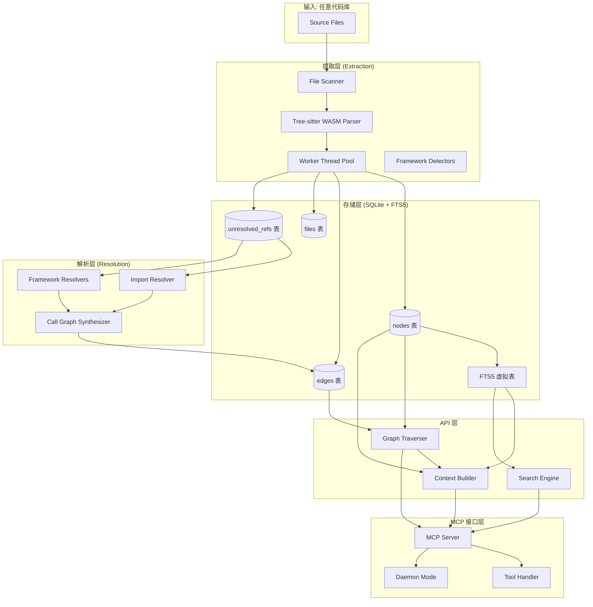
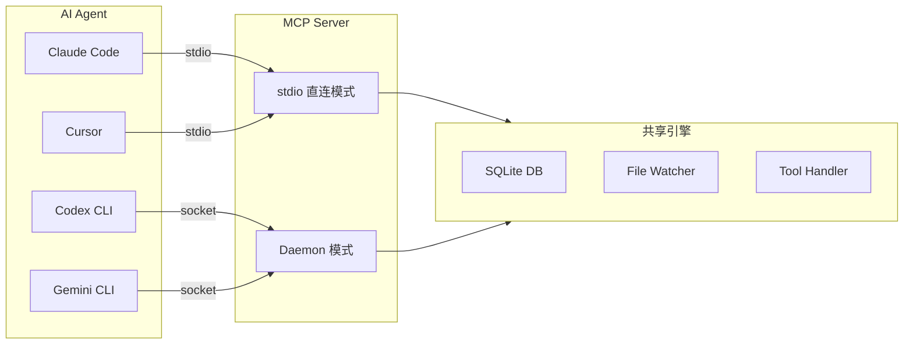

# CodeGraph 项目深度分析报告

> **分析对象**: `@colbymchenry/codegraph`（本地源码: `/home/chen/github/codegraph`）  
> **分析日期**: 2026/06/04  
> **分析维度**: 项目概述、核心功能、技术架构、代码质量、与 Understand-Anything 对比、使用场景、优缺点、总体评价

---

## 一、执行摘要

<font color="#ff4d4f">CodeGraph 是一个 100% 本地运行的代码智能系统，通过预索引的语义知识图谱为 AI 编程代理（Claude Code、Cursor、Codex 等）提供代码理解能力。</font> 与同类项目最大的区别在于：**它完全不调用 LLM，所有分析均在本地通过 Tree-sitter 静态解析完成**，核心卖点是性能优化——官方基准测试显示平均可带来 **~16% 成本降低、~58% 工具调用减少、100% 本地执行**。

项目由 `colbymchenry` 开发和维护，采用 MIT 许可证，当前版本 v0.9.9，407 次提交。它是一个面向**工程师和 AI Agent 的基础设施工具**，而非面向人类的可视化产品。

<font color="#fa8c16">架构层面</font>，CodeGraph 展现出极高的工程成熟度：SQLite + FTS5 作为存储引擎、Tree-sitter WASM 多语言解析、Worker 线程隔离内存、MCP 协议暴露工具接口、18 个框架专用解析器、自适应输出预算控制。其设计哲学是 **"做 Agent 的数据层，而非做人类的可视化层"**。

---

## 二、项目概述

### 2.1 基本信息

| 属性 | 详情 |
|------|------|
| **包名** | `@colbymchenry/codegraph` |
| **版本** | v0.9.9 |
| **License** | MIT |
| **主要语言** | TypeScript |
| **包管理器** | npm |
| **模块系统** | CommonJS（`dist/` 构建输出） |
| **Node 版本** | >= 20.0.0 < 25.0.0 |
| **Commits** | 407 |
| **Releases** | v0.9.0 ~ v0.9.9（共 10 个） |
| **源码行数** | ~295,720 行（含所有 TypeScript 文件） |
| **安装方式** | `npm i -g @colbymchenry/codegraph` 或一键 shell 脚本 |

### 2.2 项目定位

CodeGraph 的定位非常精确：**为 AI 编程代理提供预索引的代码知识图谱，替代代理原生的 grep/glob/Read 文件扫描模式**。

当 Claude Code 探索代码库时，它会生成 Explore agents，通过 `grep`、`glob`、`Read` 扫描文件——每次工具调用都消耗 token。CodeGraph 给这些代理一个**预索引的知识图谱**，包含符号关系、调用图和代码结构。代理直接查询图谱，而非扫描文件。

> *"CodeGraph gives those agents a pre-indexed knowledge graph — symbol relationships, call graphs, and code structure. Agents query the graph instantly instead of scanning files."*

### 2.3 官方基准测试结果

在 7 个真实开源代码库上测试（中位数 of 4 次运行）：

| 代码库 | 语言 | 成本节省 | Token 减少 | 时间减少 | 工具调用减少 |
|--------|------|---------|-----------|---------|-------------|
| **VS Code** | TS · ~10k 文件 | 18% | 64% | 11% | 81% |
| **Excalidraw** | TS · ~640 | 持平 | 25% | 27% | 40% |
| **Django** | Python · ~3k | 8% | 60% | 13% | 77% |
| **Tokio** | Rust · ~790 | 持平 | 38% | 18% | 57% |
| **OkHttp** | Java · ~645 | 25% | 54% | 31% | 50% |
| **Gin** | Go · ~110 | 19% | 23% | 24% | 44% |
| **Alamofire** | Swift · ~110 | 40% | 64% | 33% | 58% |
| **平均** | — | **16%** | **47%** | **22%** | **58%** |

---

## 三、核心功能

### 3.1 CLI 命令体系

| 命令 | 功能 |
|------|------|
| `codegraph install` | 交互式安装器，自动检测并配置 Claude/Cursor/Codex 等代理 |
| `codegraph init -i` | 初始化项目索引（`-i` 同时构建初始图谱） |
| `codegraph index` | 全量索引项目 |
| `codegraph sync` | 增量同步（基于 git diff 或文件哈希） |
| `codegraph watch` | 启动文件监视器，自动同步变更 |
| `codegraph status --json` | 查看索引状态、后端、日志模式 |
| `codegraph uninstall` | 从所有代理中移除 CodeGraph 配置 |
| `codegraph explore <query>` | 本地查询知识图谱（模拟 MCP 工具行为） |

### 3.2 MCP 工具接口

CodeGraph 通过 **MCP (Model Context Protocol)** 向 AI Agent 暴露以下工具：

| 工具名 | 功能 |
|--------|------|
| `codegraph_explore` | **主工具**——根据自然语言查询返回最相关的代码上下文（含关系映射和代码块） |
| `codegraph_node` | 查询特定节点的详细信息（支持包含代码） |
| `codegraph_search` | FTS 全文搜索符号 |
| `codegraph_callers` | 获取函数/方法的调用者 |
| `codegraph_callees` | 获取函数/方法的被调用者 |
| `codegraph_impact` | 计算变更影响半径 |
| `codegraph_path` | 查找两个节点间的最短路径 |
| `codegraph_deadcode` | 发现未引用符号（死代码检测） |
| `codegraph_status` | 获取索引状态和统计信息 |
| `codegraph_stats` | 获取图谱统计（节点数、边数、语言分布） |

### 3.3 核心特性

<font color="#1677ff">🔍 语义知识图谱</font>：21 种节点类型 × 12 种边类型，覆盖代码结构、调用关系、类型层次、依赖关系  
<font color="#1677ff">📊 调用图分析</font>：支持 callers/callees 查询、影响半径计算、最短路径查找  
<font color="#1677ff">🔎 全文搜索</font>：SQLite FTS5 实时索引，支持符号名、文档字符串、签名的模糊匹配  
<font color="#1677ff">🌐 多语言支持</font>：支持 20+ 编程语言（TS/JS/Python/Go/Rust/Java/C/C++/C#/PHP/Ruby/Swift/Kotlin/Dart/Svelte/Vue/Lua/Scala/Pascal/ObjC 等）  
<font color="#1677ff">🏗️ 框架感知</font>：18 个框架专用解析器（React/Vue/NestJS/Express/Laravel/Django/Flask/FastAPI/Spring/Rails/Go/Gin/Rust/SwiftUI/UIKit 等）  
<font color="#1677ff">⚡ 自适应输出预算</font>：根据项目大小动态调整 `codegraph_explore` 的输出上限，避免小项目过载、大项目不足  
<font color="#1677ff">🔄 增量同步</font>：基于 git diff 快速路径，仅重新解析变更文件  
<font color="#1677ff">👁️ 文件监视</font>：原生 OS 文件事件（FSEvents/inotify/ReadDirectoryChangesW）自动同步  
<font color="#1677ff">🛡️ 死代码检测</font>：发现未引用的函数、方法、类  
<font color="#1677ff">🌀 循环依赖检测</font>：在文件级别发现循环导入/依赖

---

## 四、技术架构分析

### 4.1 整体架构



### 4.2 存储层：SQLite + FTS5

<font color="#fa8c16">这是 CodeGraph 最核心的架构决策之一。</font>

不同于 Understand-Anything 的 JSON 文件存储，CodeGraph 使用 **SQLite** 作为持久化存储，并充分利用了 SQLite 的高级特性：

| 特性 | 用途 | 优势 |
|------|------|------|
| **FTS5** | 全文搜索符号名、文档字符串、签名 | 毫秒级模糊搜索，无需外部搜索引擎 |
| **WAL 模式** | 写前日志 | 读者不阻塞写入者，支持并发访问 |
| **触发器** | 自动同步 FTS 索引 | INSERT/DELETE/UPDATE 后 FTS5 自动更新 |
| **复合索引** | `(source, kind)` / `(target, kind)` | 高效的关系查询，避免全表扫描 |
| **外键 + CASCADE** | 节点删除时级联删除边和未解析引用 | 保证引用完整性 |

#### Schema 设计

```sql
-- 核心表: nodes（代码符号）
nodes(id, kind, name, qualified_name, file_path, language, 
      start_line, end_line, start_column, end_column, 
      docstring, signature, visibility, is_exported, ...)

-- 核心表: edges（关系边）
edges(id, source, target, kind, metadata, line, col, provenance)

-- 核心表: files（文件追踪）
files(path, content_hash, language, size, modified_at, indexed_at, node_count, errors)

-- 核心表: unresolved_refs（待解析引用）
unresolved_refs(id, from_node_id, reference_name, reference_kind, line, col, candidates, file_path, language)
```

<font color="#52c41a">Schema 设计的亮点</font>：
- `qualified_name` 存储完全限定名（如 `src/utils.ts::MathHelper.calculateTotal`），支持精确查找
- `content_hash`（SHA-256）用于增量更新检测
- `provenance` 标记边的来源（提取器/解析器/合成器），便于调试和溯源
- `unresolved_refs` 表实现**两阶段解析**：先提取原始引用，待全量索引完成后再批量解析为边

### 4.3 解析层：Tree-sitter WASM + Worker 线程

CodeGraph 使用 `web-tree-sitter` + `tree-sitter-wasms` 进行语法解析：

| 设计决策 | 说明 |
|----------|------|
| **WASM 而非原生绑定** | 零原生依赖，跨平台一致，安装简单 |
| **Worker 线程隔离** | 每个 Worker 处理 250 个文件后重启，因为 WASM 线性内存只能增长不能收缩 |
| **10 秒超时** | 防止 Tree-sitter 在异常文件上挂起 |
| **1MB 文件上限** | 跳过生成的 bundle 和压缩后的文件 |
| **I/O 批处理** | 10 个文件并行读取，重叠 I/O 等待和 CPU 解析 |

支持的编程语言：**20+ 种**，包括 TypeScript、JavaScript、Python、Go、Rust、Java、C/C++、C#、PHP、Ruby、Swift、Kotlin、Dart、Svelte、Vue、Liquid、Pascal、Scala、Lua、Luau、Objective-C、YAML、Twig、XML 等。

### 4.4 框架感知解析

<font color="#ff4d4f">这是 CodeGraph 相比通用静态分析工具的巨大差异化优势。</font>

CodeGraph 内置了 **18 个框架专用解析器**：

| 语言 | 框架 | 解析能力 |
|------|------|----------|
| JS/TS | React | JSX 组件、Hooks、Props 解析 |
| JS/TS | Vue | SFC <template>/<script>/<style> 分段解析 |
| JS/TS | Svelte | 组件和事件绑定解析 |
| JS/TS | NestJS | 装饰器路由、Module 依赖 |
| JS/TS | Express | 路由注册、中间件链 |
| Python | Django | URL 路由、View、Model 解析 |
| Python | Flask/FastAPI | 路由注册 |
| PHP | Laravel | 路由、Controller、Middleware |
| Ruby | Rails | 路由、Controller、Model |
| Java | Spring/Play | 注解路由、Bean 依赖 |
| Go | Gin | 中间件链合成 |
| Rust | Cargo Workspace | 模块解析 |
| Swift | SwiftUI/UIKit | View 层次、Modifier 链 |
| Swift | Vapor | 路由注册 |
| C# | ASP.NET | 路由、Controller |
| 跨平台 | React Native | JS ↔ Native 桥接解析 |
| 跨平台 | Expo Modules | Function/AsyncFunction/Property DSL |

这些解析器不仅提取通用 AST 节点，还理解框架特定的语义——例如 NestJS 的 `@Controller('/users')` 会被解析为 `route` 节点，并建立到 handler 方法的 `references` 边。

### 4.5 MCP 服务器架构

CodeGraph 的核心交付方式不是可视化 Dashboard，而是 **MCP (Model Context Protocol) 服务器**：



**架构亮点**：
- **守护进程模式**：一个引擎多会话共享，所有会话读取同一个 SQLite WAL 和同一个 inotify watch set
- **惰性加载**：MCP 启动时不加载 CodeGraph，仅在首次工具调用时才打开项目，将启动时间从 ~800ms 降至 ~Node 启动时间
- **跨项目查询**：ToolHandler 缓存支持跨项目查询
- **自适应预算**：`codegraph_explore` 根据项目文件数动态调整输出上限

### 4.6 上下文构建器（Context Builder）

上下文构建器是 CodeGraph 的**智能层**，负责将用户的自然语言查询转换为最相关的代码上下文：

1. **符号提取**：从查询中提取 CamelCase、snake_case、dot.notation 等符号名
2. **FTS 搜索**：用提取的符号搜索入口节点
3. **图谱扩展**：从入口节点出发，按相关性评分遍历邻居节点
4. **代码提取**：读取关键节点的源代码（容器类型返回结构大纲而非完整代码）
5. **格式化输出**：生成 Markdown 或 JSON 格式的上下文，直接注入 Agent Prompt

```
Query: "How does the payment flow work?"
  ↓
Extract symbols: ["payment", "flow", "PaymentService", ...]
  ↓
FTS search → entry nodes
  ↓
Graph traversal (BFS with relevance scoring)
  ↓
Code extraction + relationship map
  ↓
Markdown context for Claude
```

### 4.7 同步与增量更新

| 机制 | 说明 |
|------|------|
| **内容哈希** | SHA-256 检测文件变更 |
| **Git Fast Path** | 优先使用 `git diff` 获取变更文件列表，避免全目录扫描 |
| **文件监视** | 原生 OS 事件（FSEvents/inotify/ReadDirectoryChangesW）+ debounce |
| **互斥锁** | 内存 Mutex（进程内）+ 文件锁（跨进程），防止并发索引冲突 |
| **Worktree 感知** | 检测 git worktree 并将索引重定向到主仓库根目录 |
| **Git Hook** | 可选的 post-commit hook 自动同步 |

---

## 五、代码质量分析

### 5.1 工程规范

| 指标 | 状态 | 评价 |
|------|------|------|
| **TypeScript** | 严格 | 全项目 TS，核心类型在 `src/types.ts` 中以 `as const` 数组定义，确保运行时和编译时同源 |
| **测试框架** | Vitest v2 | 包含单元测试和评估测试（`__tests__/evaluation/`） |
| **代码规范** | ESLint | 配置在 `eslint.config.mjs` |
| **CI/CD** | GitHub Actions | PR + push 触发 |
| **Security** | 输入长度限制 | MCP 工具对查询、路径等输入有严格长度上限（10K/4K），防止 DoS |
| **Node 版本** | 20-24 | 紧跟 LTS， bundled runtime 模式无需用户安装 Node |

### 5.2 架构设计质量

<font color="#52c41a">卓越的设计决策</font>：

1. **WASM 隔离 + Worker 回收**：深刻理解了 WebAssembly 内存模型的限制（线性内存只增不减），通过 Worker 重启实现内存回收
2. **SQLite WAL + 复合索引**：数据库索引设计经过深思熟虑，注释明确说明为何省略某些索引（如 `idx_edges_source` 被 `(source, kind)` 覆盖）
3. **两阶段引用解析**：先提取 `unresolved_refs`，待全量索引后再批量解析，避免部分索引导致的解析失败
4. **框架后初始化**：索引完成后重新检测框架（如 SwiftUI/UIKit 扫描导入），解决"先建 resolver 后建索引"的鸡生蛋问题
5. **Lazy Loading MCP**：`loadCodeGraph` 使用 CommonJS `require()` 惰性加载，避免 MCP 冷启动 race condition
6. **自适应输出预算**：`getExploreBudget(fileCount)` 按项目规模分层，小项目输出紧凑，大项目输出丰富
7. **死代码/循环依赖检测**：在图谱层面提供代码质量分析能力

<font color="#8c8c8c">可改进之处</font>：

1. **无可视化界面**：纯工具/库定位，没有人类友好的 Dashboard（与 Understand-Anything 形成对比）
2. **CJS 构建输出**：虽然兼容性好，但无法利用 ESM 的 tree-shaking
3. **版本号 0.9.x**：尚未到达 1.0，API 可能仍有 breaking changes
4. **文档分散**：大量工程细节散落在代码注释中，外部文档相对精简

### 5.3 性能优化细节

CodeGraph 的代码中充满了**针对大规模代码库的性能优化**：

- **批量解析引用**：`resolveReferencesBatched()` 防止大仓库 OOM
- **流式扫描**：`stream node-kind scans in synthesis` 解决密集文件的内存问题
- **数据库维护**：批量写入后运行 `PRAGMA optimize` 和 WAL checkpoint
- **文件大小限制**：1MB 上限跳过 generated bundle
- **默认忽略目录**：从 github/gitignore 模板整理的 100+ 目录名，无需 `.gitignore` 也能正确排除
- **容器节点骨架化**：大类/结构体返回成员签名而非完整代码，避免 context bloat

---

## 六、与 Understand-Anything 的对比分析

| 维度 | **CodeGraph** | **Understand-Anything** |
|------|--------------|------------------------|
| **核心定位** | AI Agent 的代码数据层（性能加速器） | 代码理解工具（人类 + AI 的可视化探索） |
| **LLM 依赖** | <font color="#52c41a">🚫 零 LLM 调用，100% 本地</font> | <font color="#8c8c8c">✅ 多智能体流水线，大量 LLM 调用</font> |
| **存储格式** | SQLite + FTS5（结构化数据库） | JSON 文件（纯文本） |
| **可视化** | ❌ 无 Dashboard | ✅ React + xyflow 交互式 Dashboard |
| **语言支持** | 20+ 种（更底层） | 10 种（主流语言） |
| **框架支持** | 18 个专用解析器（更深入） | 通用框架检测（较浅） |
| **暴露方式** | MCP 协议工具 | Skill / Plugin 命令体系 |
| **增量更新** | ✅ SHA-256 + git diff + 文件监视 | ✅ 指纹机制 + `--auto-update` |
| **图谱 Schema** | 21 节点 × 12 边（简洁实用） | 21 节点 × 35 边（更丰富的关系类型） |
| **成本模型** | <font color="#52c41a">一次性索引成本，查询零成本</font> | <font color="#8c8c8c">每次分析都产生 LLM API 成本</font> |
| **平台支持** | 8 个 Agent 平台 | 14+ 个平台 |
| **Stars** | 较小众（npm 包为主） | 51.5k+（GitHub 明星项目） |
| **安装体积** | bundled runtime，无需 Node | 需 Node >= 22，pnpm，较大 |
| **团队共享** | SQLite 数据库可共享 | JSON 图谱可提交到版本控制 |
| **死代码检测** | ✅ 原生支持 | ❌ 无 |
| **循环依赖检测** | ✅ 原生支持 | ❌ 无 |
| **业务领域提取** | ❌ 无 | ✅ `/understand-domain` |
| **入职指南生成** | ❌ 无 | ✅ `/understand-onboard` |
| **多语言输出** | ❌ 英文为主 | ✅ 7+ 语言 |

### 6.1 互补性分析

<font color="#1677ff">这两个项目并非竞争关系，而是高度互补的：</font>

- **CodeGraph** 解决的是 **"Agent 如何更快、更便宜地理解代码"**——它是基础设施层
- **Understand-Anything** 解决的是 **"人类如何直观地理解代码架构"**——它是应用层

理想的工作流可能是：
1. 用 CodeGraph 为 Agent 提供实时代码查询能力（日常开发）
2. 用 Understand-Anything 生成架构概览和入职指南（架构文档、新人培训）

---

## 七、使用场景

### 7.1 最佳适用场景

| 场景 | 价值 | 原因 |
|------|------|------|
| **AI Agent 辅助开发** | ⭐⭐⭐⭐⭐ | 核心设计目标，MCP 工具直接为 Agent 提供代码上下文 |
| **大规模代码库导航** | ⭐⭐⭐⭐⭐ | FTS5 + 图谱遍历让 Agent 毫秒级定位符号，无需 grep |
| **成本敏感环境** | ⭐⭐⭐⭐⭐ | 100% 本地，无 LLM API 成本，一次性索引投入 |
| **频繁代码审查** | ⭐⭐⭐⭐ | `codegraph_impact` 快速分析变更影响范围 |
| **代码质量审计** | ⭐⭐⭐⭐ | 死代码检测、循环依赖检测原生支持 |
| **遗留系统维护** | ⭐⭐⭐⭐ | 调用图和类型层次帮助理解复杂依赖 |
| **框架特定开发** | ⭐⭐⭐⭐⭐ | React/Vue/Laravel/Django 等框架的深度语义解析 |

### 7.2 不太适用的场景

| 场景 | 原因 |
|------|------|
| **人类独立可视化探索** | 无 Dashboard/GUI，纯 CLI + MCP 工具 |
| **业务领域建模** | 不提取业务流程、领域概念 |
| **非代码知识库** | 不支持 wiki/文档分析 |
| **生成自然语言文档** | 无 LLM 摘要生成能力 |

---

## 八、优缺点分析

### 8.1 优势

| 优势 | 详细说明 |
|------|----------|
| <font color="#52c41a">100% 本地，零 LLM 成本</font> | 所有分析本地完成，无 API 调用、无 token 消耗、无网络依赖 |
| <font color="#52c41a">性能可量化</font> | 官方基准测试在 7 个真实代码库上验证，平均 16% 更便宜、58% 更少工具调用 |
| <font color="#52c41a">框架深度解析</font> | 18 个框架专用解析器，理解路由、中间件、组件等框架特定语义 |
| <font color="#52c41a">工程极度成熟</font> | WASM Worker 内存管理、SQLite WAL 并发、批量处理、输入验证、文件锁 |
| <font color="#52c41a">MCP 协议原生</font> | 作为 MCP Server 暴露，与 Claude Code / Cursor 等深度集成 |
| <font color="#52c41a">自适应输出</font> | 根据项目大小智能调整输出预算，避免 context bloat |
| <font color="#52c41a">死代码/循环依赖检测</font> | 基于图谱分析提供代码质量洞察 |
| <font color="#52c41a"> bundled runtime</font> | 一键安装脚本自带 Node runtime，无需用户预装 Node |

### 8.2 劣势

| 劣势 | 详细说明 |
|------|----------|
| <font color="#8c8c8c">无可视化界面</font> | 纯工具定位，没有人类友好的 Dashboard 或图形界面 |
| <font color="#8c8c8c">无 LLM 语义摘要</font> | 符号只有签名和文档字符串，没有自然语言解释 |
| <font color="#8c8c8c">无业务领域理解</font> | 不提取业务流程、领域概念、架构分层 |
| <font color="#8c8c8c">版本未达 1.0</font> | v0.9.9，API 可能仍有变动 |
| <font color="#8c8c8c">社区规模较小</font> | 相比 Understand-Anything 的 51.5k stars，知名度较低 |
| <font color="#8c8c8c">安装脚本信任问题</font> | `curl | sh` 模式需要用户信任远程脚本 |
| <font color="#8c8c8c">CJS 构建限制</font> | CommonJS 输出无法利用 ESM tree-shaking |

---

## 九、风险评估

### 9.1 技术风险

| 风险 | 等级 | 说明 |
|------|------|------|
| <font color="#8c8c8c">Tree-sitter WASM 限制</font> | 低 | 项目已充分处理（Worker 回收、超时、文件大小限制） |
| <font color="#8c8c8c">SQLite 并发瓶颈</font> | 低 | WAL 模式 + 文件锁已妥善解决 |
| <font color="#fa8c16">框架解析器维护成本</font> | 中 | 18 个框架解析器需要随框架版本升级而更新 |
| <font color="#fa8c16">MCP 协议兼容性</font> | 中 | MCP 协议仍在演进，可能存在 breaking changes |

### 9.2 生态风险

| 风险 | 等级 | 说明 |
|------|------|------|
| <font color="#fa8c16">单一维护者</font> | 中 | 个人项目属性，长期维护可持续性待观察 |
| <font color="#8c8c8c">替代品竞争</font> | 低 | 100% 本地 + 框架深度解析的差异化足够强 |

---

## 十、总体评价与建议

### 10.1 总体评分

| 维度 | 评分 (1-10) | 说明 |
|------|------------|------|
| **创新性** | 8 | 100% 本地的 Agent 代码数据层是独特定位 |
| **工程成熟度** | 9 | WASM Worker 管理、SQLite 优化、自适应预算、输入防护均为顶级水准 |
| **用户体验（Agent）** | 9 | MCP 工具设计精良，自适应输出，跨平台安装 |
| **用户体验（人类）** | 5 | 无可视化界面，纯 CLI 工具 |
| **代码质量** | 9 | TypeScript 严格、性能优化无处不在、完善的错误类型系统 |
| **文档质量** | 7 | README 详尽，但大量工程细节散落代码注释中 |
| **可扩展性** | 8 | 框架解析器可插拔，MCP 工具可扩展 |
| **性价比** | 9 | 一次性索引投入，永久零成本查询 |
| **综合评分** | **8.0 / 10** | |

### 10.2 适用建议

<font color="#52c41a">强烈推荐使用</font>：
- 使用 **Claude Code / Cursor / Codex** 等 AI Agent 作为主力开发工具的开发者
- 拥有 **大规模代码库**（500+ 文件）且需要频繁代码探索的团队
- **LLM API 成本敏感**的组织（CodeGraph 可切实降低 Agent 使用成本）
- 使用 **React/Vue/NestJS/Laravel/Django** 等框架进行开发的团队（框架深度解析价值巨大）
- 需要**代码质量审计**（死代码、循环依赖）的项目

<font color="#8c8c8c">不适用</font>：
- 需要**可视化架构图**的场景（选择 Understand-Anything）
- 需要**业务领域建模**或**新人入职指南生成**（选择 Understand-Anything）
- 小型脚本项目（索引开销可能超过收益）
- 不使用 AI Agent 编程的纯人工开发流程

### 10.3 方法论启示

CodeGraph 代表了 <font color="#1677ff">AI 编程工具链演进的另一个重要方向</font>：

1. **从"AI 扫描文件"到"AI 查询图谱"**：预索引知识图谱将 Agent 的文件发现成本从 O(n) 降至 O(1)
2. **确定性基础设施的价值**：在 LLM 时代，确定性工具（Tree-sitter、SQLite）作为 LLM 的"缓存层"和"加速器"具有巨大价值
3. **MCP 协议作为 AI 工具标准**：通过标准化协议暴露功能，而非绑定特定 Agent 平台
4. **性能即功能**：在 Agent 场景中，工具调用次数和 token 消耗直接影响成本和延迟，性能优化本身就是核心功能

---

## 十一、参考来源

- 本地源码分析：`/home/chen/github/codegraph`
- CodeGraph `README.md`、`CHANGELOG.md`、`CLAUDE.md`
- 源码文件：`src/index.ts`、`src/db/schema.sql`、`src/mcp/tools.ts`、`src/extraction/index.ts`、`src/context/index.ts`、`src/resolution/frameworks/index.ts`

---

*报告生成时间：2026/06/04*  
*分析工具：Claude Code + 深度源码审查*
