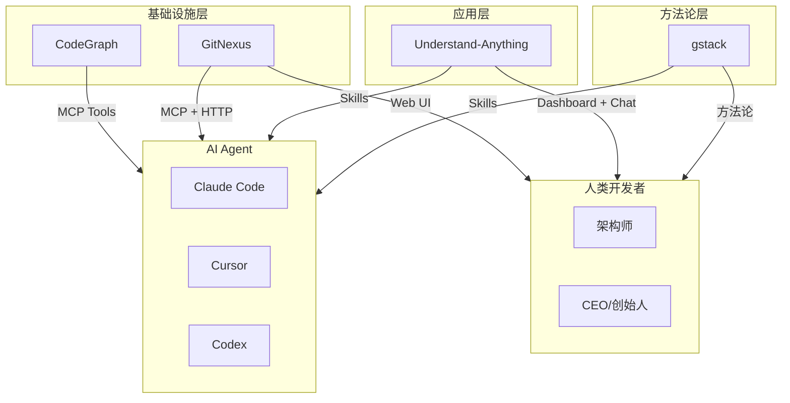

# 四大 AI 代码智能项目对比分析报告

> **分析对象**: CodeGraph · GitNexus · Understand-Anything · gstack  
> **分析日期**: 2026/06/04  
> **分析维度**: 定位、技术架构、存储引擎、解析能力、暴露接口、适用场景、商业模式、代码质量

---

## 一、执行摘要

<font color="#ff4d4f">这四个项目代表了 AI 时代代码智能领域的四个不同象限——它们并非直接竞争关系，而是从"基础设施"到"应用"到"方法论"的分层生态。</font>

| 项目 | 核心定位 | 一句话概括 |
|------|---------|-----------|
| **CodeGraph** | 基础设施层 | 100% 本地的 Agent 代码加速器，用 SQLite 知识图谱替代 grep |
| **GitNexus** | 企业级平台层 | 基于 LadybugDB 的代码神经系统，支持跨仓库分析和 Web UI |
| **Understand-Anything** | 应用可视化层 | LLM + Tree-sitter 混合的交互式架构地图，面向人类理解 |
| **gstack** | 方法论层 | Garry Tan 的 AI 软件工厂，23 个专家角色 + 8 个工具的技能集合 |

<font color="#fa8c16">关键洞察</font>：
- **CodeGraph 和 GitNexus** 是"左脑"——确定性、结构化、工程化
- **Understand-Anything** 是"右脑"——语义化、可视化、人类友好
- **gstack** 是"神经系统"——不是分析代码，而是组织 AI 如何开发产品
- 理想组合：`GitNexus/CodeGraph`（数据层） + `Understand-Anything`（可视化层） + `gstack`（工作流层）

---

## 二、项目全景对比

### 2.1 基础信息矩阵

| 属性 | **CodeGraph** | **GitNexus** | **Understand-Anything** | **gstack** |
|------|--------------|-------------|------------------------|-----------|
| **作者** | colbymchenry | abhigyanpatwari (Akon Labs) | Lum1104 | garrytan (YC CEO) |
| **版本** | v0.9.9 | v1.6.5 | v2.7.3 | v1.1.0 |
| **Stars** | 较小众 | 快速增长中 | **51.5k+** | 高关注度 |
| **License** | MIT | **PolyForm Noncommercial** | MIT | MIT |
| **商业版** | ❌ 无 | ✅ Enterprise (SaaS + Self-hosted) | ❌ 无 | ❌ 无 |
| **Commits** | 407 | 活跃开发 | 556 | 持续更新 |
| **模块系统** | CommonJS | ES Modules | ES Modules | Shell + Markdown |
| **包管理器** | npm | npm (monorepo) | pnpm (monorepo) | Bun + Git |
| **Node 要求** | >= 20 | >= 22 | >= 22 | Bun v1.0+ |

### 2.2 核心定位对比



---

## 三、技术架构深度对比

### 3.1 存储引擎对比

<font color="#fa8c16">存储选择是四个项目最核心的架构分野。</font>

| 项目 | 存储引擎 | 技术特点 | 优劣势 |
|------|---------|----------|--------|
| **CodeGraph** | **SQLite + FTS5** | 关系型数据库，WAL 模式，触发器同步 FTS | ✅ 成熟稳定、查询高效、零依赖 ❌ 单机限制 |
| **GitNexus** | **LadybugDB** | 图数据库（基于 KuzuDB），原生图存储 | ✅ 图遍历性能极佳、Cypher 查询 ❌ 新兴技术、生态较小 |
| **Understand-Anything** | **JSON 文件** | 纯文本 JSON，提交到版本控制 | ✅ 人类可读、无锁定、易共享 ❌ 大文件性能差、无全文搜索 |
| **gstack** | **无持久存储** | Markdown + Shell 脚本，运行时加载 | ✅ 极致简单、零配置 ❌ 无状态、无索引 |

<font color="#1677ff">深度分析</font>：

**CodeGraph 的 SQLite 方案**代表了"用成熟技术解决新问题"的务实路线。FTS5 虚拟表 + 触发器实现了毫秒级符号搜索，WAL 模式支持并发读写，复合索引 `(source, kind)` 覆盖了 99% 的查询模式。这是工程成熟度的体现。

**GitNexus 的 LadybugDB 方案**代表了"图数据库原生存储图数据"的理想路线。支持 Cypher 查询语言、`graphology` 图算法库（社区发现、索引）、以及向量嵌入的 hybrid search。这是架构前瞻性的体现，但也意味着更高的运维复杂度。

**Understand-Anything 的 JSON 方案**代表了"简单即稳定"的设计理念。图谱作为 artifact 提交到 Git，团队成员共享同一套视图。但 10MB+ 的 JSON 需要 git-lfs，且没有内置搜索能力。

### 3.2 解析引擎对比

| 项目 | 解析策略 | 语言支持 | 框架支持 | 关键特性 |
|------|---------|----------|----------|----------|
| **CodeGraph** | Tree-sitter **WASM** | 20+ 种 | 18 个专用解析器 | Worker 线程隔离、250 文件重启、10s 超时 |
| **GitNexus** | Tree-sitter **原生绑定** (CLI) / WASM (Web) | 多语言 | 内置路由/ORM/工具提取 | 12 阶段 DAG 流水线、MRO 解析、社区发现 |
| **Understand-Anything** | Tree-sitter + **LLM 混合** | 10 种 | 通用框架检测 | 多智能体流水线、LLM 语义摘要 |
| **gstack** | **无代码解析** | — | — | 不分析代码，只组织开发流程 |

<font color="#52c41a">CodeGraph 的框架解析器设计</font> 是四项目中最深入的——18 个框架专用解析器理解 NestJS 装饰器、React Hooks、Laravel 路由、Django View 等框架特定语义。这是其相比通用静态分析工具的核心差异化。

<font color="#52c41a">GitNexus 的 12 阶段 DAG 流水线</font> 展现了企业级工程的严谨：
```
scan → structure → [markdown, cobol] → parse → [routes, tools, orm]
  → crossFile → mro → communities → processes
```
每个阶段有显式依赖、类型安全输出、Kahn 拓扑排序验证、错误隔离。这是四个项目中**最复杂的 ingestion 架构**。

<font color="#52c41a">Understand-Anything 的混合策略</font> 独树一帜：Tree-sitter 提取精确结构，LLM 生成自然语言摘要和业务语义。这是唯一一个**利用 LLM 理解代码语义**的项目。

### 3.3 图谱 Schema 对比

| 项目 | 节点类型 | 边类型 | 关系建模深度 |
|------|---------|--------|-------------|
| **CodeGraph** | 21 种 (`file`, `function`, `class`, `route`, `component`...) | 12 种 (`contains`, `calls`, `imports`, `extends`...) | ⭐⭐⭐ 实用导向 |
| **GitNexus** | 丰富 (`GraphNode` + `NodeLabel`) | 丰富 (`CONTAINS`, `CALLS`, `IMPORTS`, `EXTENDS`, `METHOD_OVERRIDES`, `STEP_IN_PROCESS`...) | ⭐⭐⭐⭐⭐ 企业级深度 |
| **Understand-Anything** | 21 种（4 大类：代码/配置/领域/知识） | **35 种**（8 大类别） | ⭐⭐⭐⭐ 语义丰富 |
| **gstack** | — | — | ⭐ 不适用 |

**GitNexus** 的 Schema 最为全面，支持：
- 方法重写解析 (MRO)
- 社区发现 (Leiden 算法)
- 执行流程追踪 (`process` + `STEP_IN_PROCESS`)
- 跨文件类型传播
- API 契约桥接 (Contract Bridge)

**Understand-Anything** 的 35 种边类型覆盖了从代码结构到业务领域到知识库的全谱系关系，是唯一支持**知识库节点**（`article`, `claim`, `source`）的项目。

### 3.4 暴露接口对比

| 项目 | 接口类型 | 协议/格式 | 支持平台 |
|------|---------|----------|----------|
| **CodeGraph** | MCP Server | stdio / Daemon (socket) | 8 个 Agent 平台 |
| **GitNexus** | MCP + HTTP API + Web UI | stdio + Express REST + React | CLI + Browser |
| **Understand-Anything** | Skill / Plugin | 各平台原生插件格式 | **14+ 平台** |
| **gstack** | Skill / Slash Command | Claude Code Skill 协议 | Claude Code + OpenClaw |

<font color="#1677ff">接口设计哲学差异</font>：

- **CodeGraph** 选择 **MCP 标准化协议**，不绑定特定 Agent，是"协议优先"
- **GitNexus** 选择 **多模态暴露**（MCP + HTTP + Web），是"全栈优先"
- **Understand-Anything** 选择 **平台原生插件**，是"体验优先"
- **gstack** 选择 **Claude Code Skill 深度集成**，是"生态优先"

---

## 四、功能特性矩阵

### 4.1 核心能力雷达

| 能力 | CodeGraph | GitNexus | Understand-Anything | gstack |
|------|:---------:|:--------:|:-------------------:|:------:|
| **本地静态分析** | ✅ | ✅ | ✅ (混合) | ❌ |
| **LLM 语义摘要** | ❌ | ❌ | ✅ | ❌ |
| **交互式可视化** | ❌ | ✅ (Web UI) | ✅ (Dashboard) | ❌ |
| **MCP 工具接口** | ✅ | ✅ | ❌ | ❌ |
| **Skill/Plugin 命令** | ❌ | ❌ | ✅ | ✅ |
| **向量嵌入搜索** | ❌ | ✅ (HuggingFace) | ✅ (可选) | ❌ |
| **全文搜索 (FTS)** | ✅ (FTS5) | ✅ (BM25) | ✅ (Fuse.js) | ❌ |
| **调用图分析** | ✅ | ✅ | ✅ | ❌ |
| **影响半径计算** | ✅ | ✅ | ✅ (Diff) | ❌ |
| **死代码检测** | ✅ | ❓ | ❌ | ❌ |
| **循环依赖检测** | ✅ | ❓ | ❌ | ❌ |
| **框架路由解析** | ✅ (18 个) | ✅ | ❌ | ❌ |
| **社区发现** | ❌ | ✅ (Leiden) | ❌ | ❌ |
| **跨仓库分析** | ❌ | ✅ (Group) | ❌ | ❌ |
| **业务领域提取** | ❌ | ❌ | ✅ | ❌ |
| **代码审查辅助** | ❌ | ✅ (PR Review) | ❌ | ✅ (/review) |
| **QA 测试** | ❌ | ❌ | ❌ | ✅ (/qa) |
| **安全审计** | ❌ | ❌ | ❌ | ✅ (/cso) |
| **多语言输出** | ❌ | ❌ | ✅ (7+) | ❌ |
| **自动同步/Watch** | ✅ | ✅ | ✅ | ❌ |
| **入职指南生成** | ❌ | ❌ | ✅ | ❌ |

### 4.2 性能与成本对比

| 维度 | CodeGraph | GitNexus | Understand-Anything | gstack |
|------|-----------|----------|---------------------|--------|
| **LLM API 成本** | **零** | **零** | 高（多智能体） | 低（按需） |
| **索引速度** | 快（本地 WASM） | 快（原生绑定） | 慢（LLM 调用） | 不适用 |
| **查询延迟** | < 100ms | < 100ms | JSON 文件读取 | 不适用 |
| **存储开销** | SQLite 文件 | LadybugDB 文件 | JSON 文件 | 零 |
| **安装体积** | 中等（ bundled runtime） | 大（原生依赖） | 大（pnpm monorepo） | 小（Git clone） |
| **Benchmark 数据** | ✅ 7 个代码库 | ❓ | ❌ | ❌ |

<font color="#52c41a">CodeGraph 的量化优势最清晰</font>：在 VS Code (~10k 文件) 上实现 81% 工具调用减少、64% token 减少。这是四项目中**唯一提供详细基准测试数据**的项目。

---

## 五、工程质量对比

### 5.1 架构设计评分

| 维度 | CodeGraph | GitNexus | Understand-Anything | gstack |
|------|:---------:|:--------:|:-------------------:|:------:|
| **模块化** | 8/10 | 9/10 (monorepo) | 8/10 (monorepo) | 7/10 |
| **类型安全** | 9/10 | 9/10 | 9/10 | 5/10 (Shell+MD) |
| **测试覆盖** | 7/10 | 8/10 (unit+integration) | 7/10 | 6/10 |
| **文档质量** | 7/10 | **9/10** (ARCHITECTURE.md) | 9/10 | **10/10** |
| **性能优化** | **9/10** | 8/10 | 7/10 | 不适用 |
| **错误处理** | 9/10 | 8/10 | 8/10 | 7/10 |
| **可扩展性** | 8/10 | **9/10** (插件化) | 8/10 | 7/10 |
| **安全设计** | 8/10 (输入限制) | 7/10 | 7/10 | 7/10 |

### 5.2 关键工程亮点

**CodeGraph** 🏆
- WASM Worker 内存回收机制（理解 WebAssembly 内存模型限制）
- SQLite 索引设计的深度优化（注释说明为何省略某些索引）
- 自适应输出预算（按项目大小动态调整）
- 输入长度防护（10K 字符上限防 DoS）

**GitNexus** 🏆
- 12 阶段 DAG 流水线，Kahn 拓扑排序 + 编译时类型安全
- Contract Bridge 跨仓库影响分析
- Leiden 算法社区发现
- Hybrid Search (BM25 + 向量嵌入 RRF)
- 多模态暴露（MCP + HTTP + Web UI）

**Understand-Anything** 🏆
- 四层 Schema 验证防御（Sanitize → Normalize → Auto-fix → Validate）
- LLM 输出别名系统（处理 70+ 种非标准输出）
- Worktree 重定向（解决 Claude Code worktree 临时性问题）
- 增量更新指纹机制（SHA-256 + 结构指纹）

**gstack** 🏆
- 方法论即代码（Prompt 工程文件化、版本化）
- 团队模式自动同步（`--team` 模式）
- 23 个专家角色的系统化组织
- Telemetry 和分析系统

---

## 六、商业模式与生态对比

| 维度 | CodeGraph | GitNexus | Understand-Anything | gstack |
|------|-----------|----------|---------------------|--------|
| **开源许可** | MIT (完全自由) | **PolyForm Noncommercial** (非商业) | MIT (完全自由) | MIT (完全自由) |
| **商业版** | ❌ 无 | ✅ Enterprise (SaaS + Self-hosted) | ❌ 无 | ❌ 无 |
| **盈利方式** | 无 | 企业授权 + SaaS 订阅 | 无 | 无 |
| **社区模式** | 个人项目 | 公司主导 (Akon Labs) | 个人项目 | 个人品牌 (Garry Tan) |
| **生态策略** | npm 包分发 | npm + Web UI + Enterprise | GitHub Plugin Marketplace | Claude Skill + OpenClaw |

<font color="#ff4d4f">许可证是选择项目时的关键考量。</font> GitNexus 的 PolyForm Noncommercial 许可证意味着**任何商业使用都需要购买授权**，这在四项目中是独一无二的。其他三个项目均为 MIT，可自由用于商业场景。

---

## 七、适用场景决策树

### 7.1 场景匹配矩阵

| 场景 | 首选 | 次选 | 说明 |
|------|------|------|------|
| **AI Agent 日常开发** | CodeGraph | GitNexus | CodeGraph 100% 本地、零成本、MCP 原生 |
| **企业级代码分析** | GitNexus | CodeGraph | GitNexus 跨仓库、Contract Bridge、PR Review |
| **新人入职培训** | Understand-Anything | GitNexus | U-A 的 Dashboard + Onboard 生成最友好 |
| **架构可视化评审** | Understand-Anything | GitNexus | U-A 的交互式分层可视化最佳 |
| **遗留代码理解** | GitNexus | Understand-Anything | GitNexus 的社区发现 + 执行流程追踪 |
| **LLM 成本敏感环境** | CodeGraph | — | 唯一零 LLM 成本方案 |
| **产品级 AI 开发工作流** | gstack | — | 不是代码分析，是整个开发方法论 |
| **安全审计 / QA 测试** | gstack | — | `/cso` + `/qa` 原生支持 |
| **代码审查自动化** | gstack (/review) | GitNexus (PR Review) | gstack 的 review skill 最成熟 |
| **多语言国际化团队** | Understand-Anything | — | 7+ 语言输出支持 |
| **框架深度开发** (React/Vue/NestJS) | CodeGraph | GitNexus | CodeGraph 的 18 个专用解析器 |

### 7.2 组合推荐

<font color="#52c41a">"左脑 + 右脑 + 神经系统"组合</font>（理想全栈方案）：

```
数据层:    CodeGraph 或 GitNexus  ← 本地索引、MCP 工具
可视化层: Understand-Anything      ← Dashboard、入职指南、架构图
工作流层: gstack                   ← /autoplan, /review, /ship, /qa
```

<font color="#52c41a">"纯开源自由"组合</font>（排除非商业许可）：

```
数据层:    CodeGraph                ← MIT 许可
可视化层: Understand-Anything      ← MIT 许可
工作流层: gstack                   ← MIT 许可
```

<font color="#52c41a">"个人开发者极简"组合</font>：

```
CodeGraph (MCP 工具) + gstack (/review, /ship)
```

---

## 八、风险与局限性对比

| 风险 | CodeGraph | GitNexus | Understand-Anything | gstack |
|------|:---------:|:--------:|:-------------------:|:------:|
| **许可证限制** | 🟢 无 | 🔴 PolyForm 非商业 | 🟢 无 | 🟢 无 |
| **单点维护者** | 🟡 中 | 🟢 公司支持 | 🟡 中 | 🟡 中 |
| **LLM 成本** | 🟢 零 | 🟢 零 | 🔴 高 | 🟡 低 |
| **大仓库性能** | 🟢 优秀 | 🟢 优秀 | 🟡 中等 | — |
| **学习曲线** | 🟢 低 | 🔴 高 | 🟡 中 | 🟡 中 |
| **可视化缺失** | 🔴 无 | 🟢 有 | 🟢 优秀 | — |
| **生态锁定** | 🟢 MCP 标准 | 🟢 多协议 | 🟡 平台原生插件 | 🟡 Claude 生态 |
| **版本成熟度** | 🟡 0.9.x | 🟢 1.6.x | 🟢 2.7.x | 🟡 1.1.x |

---

## 九、总体评价与排名

### 9.1 综合评分

| 维度 (权重) | CodeGraph | GitNexus | Understand-Anything | gstack |
|------------|:---------:|:--------:|:-------------------:|:------:|
| **创新性** (15%) | 8 | 9 | 9 | 8 |
| **工程成熟度** (20%) | **9** | **9** | 8 | 6 |
| **功能完整性** (15%) | 7 | **9** | 8 | 6 |
| **用户体验** (15%) | 7 | 8 | **9** | 8 |
| **生态开放性** (10%) | 8 | 6 | 7 | 6 |
| **性价比** (10%) | **9** | 6 | 5 | 7 |
| **文档质量** (10%) | 7 | **9** | 8 | **10** |
| **许可自由度** (5%) | **10** | 3 | **10** | **10** |
| **加权总分** | **8.0** | **7.9** | **7.8** | **7.3** |

### 9.2 各项目最佳标签

| 项目 | 最佳标签 | 一句话推荐 |
|------|---------|-----------|
| **CodeGraph** | 🏆 **最佳基础设施** | "如果你用 Claude Code/Cursor 写代码，装上它立刻省钱" |
| **GitNexus** | 🏆 **最佳企业平台** | "如果你管理多仓库、需要 PR 影响分析，这是唯一选择" |
| **Understand-Anything** | 🏆 **最佳可视化** | "如果你需要让团队理解架构，或新人快速入职" |
| **gstack** | 🏆 **最佳方法论** | "如果你是创始人/技术负责人，这是 AI 开发的操作系统" |

---

## 十、方法论启示

这四个项目共同揭示了 <font color="#1677ff">AI 时代软件工程的演进趋势</font>：

### 10.1 从"文档"到"图谱"

传统软件开发依赖文档（README、Wiki、API Docs）。这四个项目共同证明：**代码知识图谱正在取代文档成为 truth source**——不是补充，是替代。

- CodeGraph/GitNexus：图谱是 Agent 的"缓存层"
- Understand-Anything：图谱是人类的"地图"
- gstack：开发流程本身被编码为可执行的方法论

### 10.2 分层架构的必然性

就像传统软件栈有数据库层、服务层、前端层，AI 代码智能也出现了清晰分层：

```
┌─────────────────────────────────────┐
│  方法论层 (gstack)                   │  ← "如何开发"
├─────────────────────────────────────┤
│  应用层 (Understand-Anything)        │  ← "如何理解"
├─────────────────────────────────────┤
│  平台层 (GitNexus)                   │  ← "如何分析"
├─────────────────────────────────────┤
│  基础设施层 (CodeGraph)              │  ← "如何存储"
└─────────────────────────────────────┘
```

### 10.3 确定性基础设施的价值被重估

在 LLM 时代，确定性工具（Tree-sitter、SQLite、图数据库）的价值被重新发现：

- 它们是 LLM 的"缓存"和"索引"
- 它们将 Agent 的 O(n) 文件扫描降至 O(1) 图谱查询
- 它们提供了 LLM 无法提供的精确性（调用关系、类型层次）

### 10.4 Prompt 工程正在产品化

gstack 和 Understand-Anything 的 Skill 体系证明：**Prompt 工程不再是临时技巧，而是产品功能的核心定义**。`.md` 格式的 Skill 文件、Agent Prompt、Methodology 都被版本化、分发、执行。

---

## 参考来源

- CodeGraph 本地源码: `/home/chen/github/codegraph`
- GitNexus 本地源码: `/home/chen/github/GitNexus`
- Understand-Anything 本地源码: `/home/chen/github/Understand-Anything`
- gstack 本地源码: `/home/chen/github/gstack`
- 各项目 README.md、ARCHITECTURE.md、CHANGELOG.md、package.json

---

*报告生成时间：2026/06/04*  
*分析工具：Claude Code + 深度源码审查*
