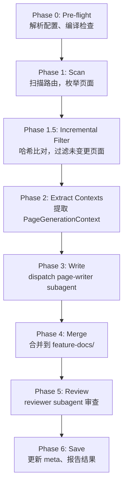

# gant-atlas-generate Skill 安装与部署指南

## 概述

`/gant-atlas-generate` 是 gant-atlas 的 Claude Code Skill，用于从源代码批量生成前端功能清单 Markdown 文档。

它采用 **Hybrid 架构**：
- **MCP Server**（10 个 tools）：实时查询、分析、校验已入库的 feature-docs
- **Skill**（`/gant-atlas-generate`）：批量生成新的 feature-docs，通过 subagent 分批写入

---

## 前置条件

| 依赖 | 版本要求 | 说明 |
|------|---------|------|
| Node.js | >= 22 | ES Modules 运行环境 |
| pnpm | >= 10 | 包管理器 |
| gant-atlas | 当前版本 | 需要编译后的 `dist/` |
| Claude Code | 最新版 | Skill 运行宿主 |

---

## 快速安装

### 1. 编译 gant-atlas

```bash
cd /path/to/gant-atlas
pnpm install
pnpm run build
```

### 2. 安装 Skill

```bash
cd /path/to/gant-atlas
bash skills/install.sh
```

这会在 `~/.claude/skills/gant-atlas-generate` 创建一个指向 `skills/generate-docs/` 的符号链接。

验证安装：

```bash
bash skills/install.sh --check
```

### 3. 配置项目

创建或编辑 `~/.gant-atlas/projects.json`：

```json
{
  "projects": [
    {
      "id": "ibom",
      "docsPath": "/path/to/ai-harness-root/docs/ibom",
      "codeDir": "/path/to/packages/ibom/src",
      "routesFile": "/path/to/packages/ibom/src/maps.ts",
      "dbPath": "~/.gant-atlas/ibom.db"
    }
  ]
}
```

| 字段 | 必需 | 说明 |
|------|------|------|
| `id` | 是 | 项目唯一标识，调用 skill 时传入 |
| `docsPath` | 是 | feature-docs 输出目录 |
| `codeDir` | 是 | 前端源码根目录 |
| `routesFile` | 是 | 路由映射文件路径 |
| `dbPath` | 否 | SQLite 数据库路径（自动 ingest 时用） |

---

## 使用方式

在 Claude Code 对话中输入：

```bash
# 全量生成
/gant-atlas-generate ibom

# 指定模块
/gant-atlas-generate ibom --module dataAuth

# 指定单个页面
/gant-atlas-generate ibom --page dataAuth/dataAuthGroup

# 强制全量重新生成（忽略增量检测）
/gant-atlas-generate ibom --full
```

---

## 执行流程



### 增量机制

Phase 1.5 计算每个页面目录下所有源码文件（`.ts/.tsx/.js/.jsx`）的 SHA-256 哈希，与 `generate-meta.json` 中记录的上次哈希比对：

- **哈希相同** → 跳过该页面
- **哈希不同或新增页面** → 纳入本次生成
- **`--full`** → 跳过增量检测，全量重新生成

元数据存储位置：`$PROJECT_ROOT/.gant-atlas/generate-meta.json`

### Subagent 调度

Phase 3 中按每 5 页一批分组，最多 3 个 `page-writer` subagent 并发执行。每个 subagent：
1. 读取 `PageGenerationContext` JSON
2. 根据上下文生成 `main.md`、`search-area.md`、`grid-area.md`、`button-area.md`、`api-area.md`
3. 不确定的标注 `[AI生成-需确认]`

---

## Skill 文件结构

```
skills/
├── install.sh                                  # 安装脚本
├── generate-docs/
│   ├── SKILL.md                                # 主编排（7 阶段流水线）
│   ├── agents/
│   │   ├── page-writer.md                      # 生成 Markdown 的 subagent
│   │   └── reviewer.md                         # 审查结果的 subagent
│   └── scripts/
│       ├── scan-pages.mjs                      # 枚举可生成页面
│       ├── extract-page-context.mjs            # 提取单页上下文
│       ├── compute-source-hash.mjs             # 计算源码哈希
│       ├── incremental-filter.mjs              # 增量过滤
│       ├── update-generate-meta.mjs            # 更新生成元数据
│       └── merge-docs.mjs                      # 合并到 feature-docs/
```

---

## MCP Server 配置

除了 Skill，gant-atlas 的 MCP Server 也需要配置在 Claude Code 的 MCP 设置中：

```json
{
  "mcpServers": {
    "gant-atlas": {
      "command": "node",
      "args": ["/path/to/gant-atlas/dist/index.js", "mcp", "serve"],
      "env": {
        "GANT_ATLAS_CONFIG": "~/.gant-atlas/projects.json"
      }
    }
  }
}
```

MCP 提供 10 个 tools，用于实时查询已入库的知识图：

| Tool | 说明 |
|------|------|
| `get_page_spec` | 获取页面完整功能清单 |
| `search_pages` | 按条件搜索页面 |
| `analyze_impact` | 分析 API/字段变更影响面 |
| `check_consistency` | 校验文档与代码一致性 |
| `list_projects` | 列出已配置的项目 |
| `get_page_generation_context` | 获取页面生成上下文 |
| `explore_context` | 探索上下文关系 |
| `find_dead_apis` | 查找未被引用的 API |
| `get_call_graph` | 获取调用图 |
| `generate_page_spec` | 生成页面骨架 |
| `list_entries` | 列出知识图条目 |

---

## 卸载

```bash
cd /path/to/gant-atlas
bash skills/install.sh --uninstall
```

---

## 故障排查

| 问题 | 原因 | 解决方案 |
|------|------|---------|
| `Compiled core not found` | 未编译 dist/ | `cd gant-atlas && pnpm run build` |
| `Cannot find module` | 脚本中 PLUGIN_ROOT 路径错误 | 检查符号链接是否正确指向 `skills/generate-docs/` |
| `page not found in routes` | routesFile 路径错误或格式不兼容 | 检查 routesFile 路径，确认 `scanRoutes` 能解析 |
| Skill 无响应 | 未安装到 `~/.claude/skills/` | 运行 `bash skills/install.sh` |
| 增量检测不生效 | `generate-meta.json` 被删除 | 正常现象，首次运行会全量生成 |
| 生成质量差 | 源码结构不符合约定 | 确保有 `schema.ts`、`services.ts`、页面组件文件 |
