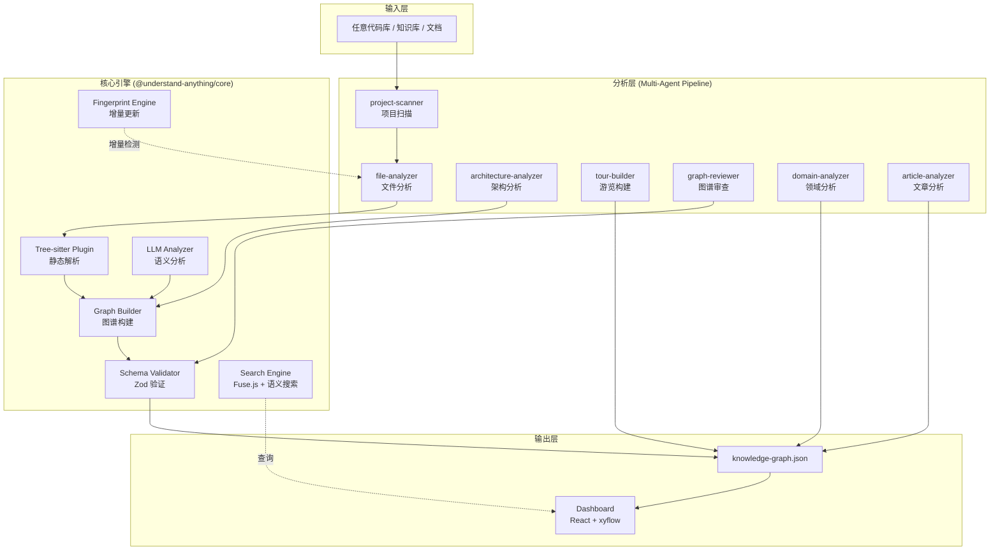

# Understand-Anything 项目深度分析报告

> **分析对象**: [Lum1104/Understand-Anything](https://github.com/Lum1104/Understand-Anything)  
> **分析日期**: 2026/06/04  
> **分析维度**: 项目概述、核心功能、技术架构、代码质量、使用场景、优缺点、风险评估、总体评价

---

## 一、执行摘要

<font color="#ff4d4f">Understand-Anything 是当前 AI 辅助代码理解领域最活跃、星标最高的开源项目之一（51.5k+ Stars）。</font> 它将 LLM 语义分析与 Tree-sitter 静态解析相结合，通过多智能体流水线将任意代码库转换为可交互的知识图谱。项目采用 MIT 许可证，以 TypeScript 为主栈，支持 14+ AI 编程平台，其核心理念是 **"Graphs that teach, not graphs that impress"**——追求实用性而非视觉炫技。

<font color="#fa8c16">架构层面</font>，项目展现出成熟的分层设计：核心引擎（`@understand-anything/core`）负责图谱构建与验证，Dashboard（`@understand-anything/dashboard`）提供可视化交互，Skill 层定义 CLI 命令与 LLM 协作协议。其知识图谱 Schema 定义了 <font color="#1677ff">21 种节点类型、35 种边类型、8 大关系类别</font>，具备企业级代码知识建模能力。

<font color="#52c41a">适用场景</font>：新人入职、遗留代码理解、架构评审、变更影响分析、业务领域知识提取。

---

## 二、项目概述

### 2.1 基本信息

| 属性 | 详情 |
|------|------|
| **仓库地址** | `github.com/Lum1104/Understand-Anything` |
| **Stars** | ~51,500 ⭐ |
| **Forks** | ~4,200 |
| **License** | MIT |
| **主要语言** | TypeScript (70.4%)、JavaScript (15.7%)、Python (9.7%) |
| **包管理器** | pnpm 10.6.2 |
| **模块系统** | ES Modules (`"type": "module"`) |
| **最新版本** | v2.7.3 (2026-05-19) |
| **Commits** | 556 |
| **Issues** | 63 |
| **Pull Requests** | 95 |
| **Security Alerts** | 0 |

### 2.2 项目定位

Understand-Anything 是一个 **Claude Code 插件**，同时支持 Cursor、VS Code + GitHub Copilot、Codex、Gemini CLI 等 14+ AI 编程平台。它的目标不是替代开发者阅读代码，而是**将代码库的结构、关系和业务语义显式化**，降低认知负载。

> *"The goal isn't a graph that wows you with how complex your codebase is — it's a graph that quietly teaches you how every piece fits together."*

---

## 三、核心功能

### 3.1 命令体系

| 命令 | 功能描述 |
|------|----------|
| `/understand` | 运行完整的多智能体分析流水线，生成 `knowledge-graph.json` |
| `/understand-dashboard` | 启动交互式 Web Dashboard（基于 React + xyflow） |
| `/understand-chat <question>` | 基于知识图谱进行自然语言问答 |
| `/understand-diff` | 分析未提交变更的影响范围 |
| `/understand-explain <path>` | 深度解释特定文件或函数 |
| `/understand-onboard` | 生成新成员入职指南 |
| `/understand-domain` | 提取业务领域、流程和步骤 |
| `/understand-knowledge <path>` | 分析 LLM wiki 知识库（Karpathy 模式） |

### 3.2 核心特性

<font color="#1677ff">🔍 结构图谱</font>：将文件、函数、类可视化为可点击节点，边表示导入、调用、继承等关系  
<font color="#1677ff">🧭 引导式游览（Tour）</font>：自动生成按依赖排序的架构导览路径  
<font color="#1677ff">🔎 模糊与语义搜索</font>：Fuse.js 实现模糊搜索，可选向量嵌入实现语义搜索  
<font color="#1677ff">📊 Diff 影响分析</font>：在提交前可视化变更的涟漪效应  
<font color="#1677ff">🎭 角色自适应 UI</font>：Dashboard 根据用户角色（初级开发者、PM、高级用户）调整界面  
<font color="#1677ff">🏗️ 分层可视化</font>：自动按架构层（API、Service、Data、UI、Utility）分组  
<font color="#1677ff">📚 语言概念解释</font>：12 种编程语言的设计模式在上下文中解释  
<font color="#1677ff">🌍 多语言支持</font>：支持中英日韩西土俄等语言输出

---

## 四、技术架构分析

### 4.1 整体架构



### 4.2 混合解析策略：Tree-sitter + LLM

<font color="#fa8c16">这是项目最核心的架构决策。</font>

| 维度 | Tree-sitter (确定性) | LLM (语义性) |
|------|---------------------|-------------|
| **作用** | 将源码解析为具体语法树 (CST) | 基于解析结构生成自然语言摘要 |
| **提取内容** | 导入/导出、函数/类定义、调用点、继承关系 | 自然语言摘要、标签、架构层分配、业务域映射 |
| **优势** | 精确、快速、低成本、可复现 | 理解业务语义、识别设计模式、生成可读描述 |
| **劣势** | 无法理解语义和意图 | 成本高、输出不稳定、可能幻觉 |
| **协同方式** | Tree-sitter 提取 `importMap` 和结构指纹，LLM 在此基础上补充语义层 | |

Tree-sitter 插件当前支持 **10 种语言**：TypeScript、JavaScript、Python、Go、Rust、Java、Ruby、PHP、C/C++、C#。每种语言有独立的 WASM grammar 和提取器。

### 4.3 知识图谱 Schema 设计

<font color="#ff4d4f">Schema 设计是该项目 engineering 深度的集中体现。</font>

#### 节点类型（21 种，分 4 大类）

| 类别 | 节点类型 | 说明 |
|------|---------|------|
| **代码结构** (5) | `file`, `function`, `class`, `module`, `concept` | 程序实体的基础建模 |
| **非代码配置** (8) | `config`, `document`, `service`, `table`, `endpoint`, `pipeline`, `schema`, `resource` | 基础设施与配置 |
| **业务领域** (3) | `domain`, `flow`, `step` | 业务语义层 |
| **知识库** (5) | `article`, `entity`, `topic`, `claim`, `source` | 支持 wiki/文档分析 |

#### 边类型（35 种，分 8 大类）

- **Structural**: `imports`, `exports`, `contains`, `inherits`, `implements`
- **Behavioral**: `calls`, `subscribes`, `publishes`, `middleware`
- **Data flow**: `reads_from`, `writes_to`, `transforms`, `validates`
- **Dependencies**: `depends_on`, `tested_by`, `configures`
- **Semantic**: `related`, `similar_to`
- **Infrastructure**: `deploys`, `serves`, `provisions`, `triggers`
- **Domain**: `contains_flow`, `flow_step`, `cross_domain`
- **Knowledge**: `cites`, `contradicts`, `builds_on`, `exemplifies`, `categorized_under`, `authored_by`

#### Schema 验证的四层防御体系

```
Tier 1: Sanitize      → 空值处理、大小写规范化
Tier 2: Auto-fix      → 默认值填充、类型强制转换、别名映射
Tier 3: Validate      → Zod schema 校验、引用完整性检查
Tier 4: Fatal Guard   → 集合类型校验、元数据必填校验
```

<font color="#52c41a">特别值得称赞的是别名系统</font>：项目维护了一套 `NODE_TYPE_ALIASES` 和 `EDGE_TYPE_ALIASES`，将 LLM 常见的非标准输出（如 `func` → `function`, `extends` → `inherits`）自动规范化，这体现了对 LLM 输出不稳定性的深刻理解。

### 4.4 增量更新机制

项目实现了基于 **SHA-256 内容哈希 + 结构指纹** 的增量分析：

1. **Fingerprint 提取**：对每个文件提取函数签名、类结构、导入导出关系的指纹
2. **变更分级**：`NONE`（无变化）→ `COSMETIC`（仅实现细节变化）→ `STRUCTURAL`（结构变化）
3. **增量分析**：仅重新分析变更文件，保留未变更文件的图谱节点
4. **自动同步**：`--auto-update` 可创建 post-commit hook，在每次提交后自动更新图谱

```typescript
export interface FileFingerprint {
  filePath: string;
  contentHash: string;
  functions: FunctionFingerprint[];
  classes: ClassFingerprint[];
  imports: ImportFingerprint[];
  exports: string[];
  totalLines: number;
}
```

### 4.5 Dashboard 前端架构

| 技术选型 | 说明 |
|---------|------|
| **框架** | React 19 + TypeScript |
| **构建工具** | Vite 6 |
| **样式** | Tailwind CSS v4 |
| **状态管理** | Zustand 5 |
| **图可视化** | @xyflow/react (React Flow) + @dagrejs/dagre + elkjs |
| **图算法** | graphology + graphology-communities-louvain（社区发现） |
| **物理布局** | d3-force |
| **搜索** | Fuse.js（模糊搜索）+ 可选向量嵌入（语义搜索） |
| **Markdown 渲染** | react-markdown + hast-util-to-jsx-runtime |
| **代码高亮** | prism-react-renderer |

<font color="#52c41a">前端设计亮点</font>：
- **懒加载策略**：CodeViewer、LearnPanel、PathFinderModal 等重型组件使用 `React.lazy` 分包
- **Demo 模式**：支持通过环境变量切换为演示模式，无需真实代码库
- **Token 门禁**：通过 URL query token 或 sessionStorage 控制访问权限
- **移动端适配**：独立的 MobileLayout 组件 + `useIsMobile` hook

### 4.6 多智能体流水线

执行 `/understand` 时，按顺序编排 7 个专业智能体：

| 智能体 | 职责 | 输出 |
|--------|------|------|
| `project-scanner` | 发现文件，检测语言和框架 | 文件列表、语言统计 |
| `file-analyzer` | 提取函数、类、导入；生成图节点和边 | 文件级图谱片段 |
| `architecture-analyzer` | 识别架构分层（API/Service/Data/UI/Utility） | 层分配 |
| `tour-builder` | 生成依赖排序的引导式学习路径 | Tour 步骤 |
| `graph-reviewer` | 验证图完整性和引用完整性 | 修复建议 |
| `domain-analyzer` | 提取业务域、流程和步骤 | 领域节点 |
| `article-analyzer` | 从 wiki 文章提取实体和隐式关系 | 知识节点 |

文件分析器并行运行：<font color="#1677ff">最多 5 个并发，每批 20-30 个文件</font>。这是平衡 LLM API 速率限制与总耗时的合理设计。

---

## 五、代码质量分析

### 5.1 工程规范

| 指标 | 状态 | 评价 |
|------|------|------|
| **TypeScript 严格度** | 高 | 全项目使用 TS，核心包有完整类型导出 |
| **Schema 验证** | 优秀 | Zod 定义完整，四层防御体系 |
| **测试框架** | Vitest | 核心包和 skill 层均有测试覆盖 |
| **代码规范** | ESLint v9 | 使用扁平配置 (`eslint.config.mjs`) |
| **CI/CD** | GitHub Actions | PR + push 触发，包含 lint/build/test |
| **Security** | 0 alerts | GitHub Security 无告警 |
| **Node 版本** | >= 22 | 紧跟 LTS |

### 5.2 架构设计质量

<font color="#52c41a">优秀的设计决策</font>：

1. **插件化语言支持**：`LanguageExtractor` 接口 + `PluginRegistry` 使得新增语言只需实现一个提取器
2. **图谱格式去 AI 锁定**：纯 JSON 格式，Dashboard 可独立运行，不依赖特定 LLM 提供商
3. **Worktree 重定向**：检测到 git worktree 时自动将输出重定向到主仓库根目录（解决 Claude Code worktree 临时性问题）
4. **多语言 README**：提供 7 种语言的 README，体现国际化意识
5. **Monorepo 结构清晰**：`core` / `dashboard` / `skill` 三层分离，pnpm workspace 管理

<font color="#8c8c8c">可改进之处</font>：

1. **测试覆盖可见度**：虽有 Vitest 配置，但公开信息中未显示具体覆盖率报告
2. **核心包依赖较重**：`@understand-anything/core` 依赖 11 个 tree-sitter 语言包 + web-tree-sitter WASM，安装体积大
3. **Python 脚本混合**：skill 层中混有 `.mjs` 和 `.py` 脚本，增加了运行时复杂度

### 5.3 文档质量

| 文档 | 质量 | 说明 |
|------|------|------|
| `README.md` | ⭐⭐⭐⭐⭐ | 结构清晰，包含安装、使用、截图、视频链接 |
| `CLAUDE.md` | ⭐⭐⭐⭐⭐ | 专为 Claude Code 优化的项目上下文文档 |
| `CONTRIBUTING.md` | ⭐⭐⭐⭐ | 贡献指南完整 |
| `SECURITY.md` | ⭐⭐⭐⭐ | 安全策略存在 |
| Skill 定义文件 | ⭐⭐⭐⭐⭐ | 每个 skill 有详细的 `SKILL.md`，定义命令、选项、执行阶段 |
| Agent Prompt 文件 | ⭐⭐⭐⭐⭐ | `.md` 格式的 prompt 工程，便于版本控制 |

---

## 六、使用场景

### 6.1 最佳适用场景

| 场景 | 价值 | 原因 |
|------|------|------|
| **新人入职** | ⭐⭐⭐⭐⭐ | 提交的图谱让新成员第一天即可打开交互式架构地图，按依赖顺序进行引导式游览 |
| **遗留代码理解** | ⭐⭐⭐⭐⭐ | 将无文档的代码库结构显式化，自然语言问答降低认知门槛 |
| **架构评审** | ⭐⭐⭐⭐ | 分层可视化和依赖关系图帮助发现架构腐化和循环依赖 |
| **变更影响分析** | ⭐⭐⭐⭐ | `/understand-diff` 在提交前可视化涟漪效应，减少回归风险 |
| **跨团队知识共享** | ⭐⭐⭐⭐ | 图谱可提交到版本控制，团队成员共享同一套架构视图 |

### 6.2 不太适用的场景

| 场景 | 原因 |
|------|------|
| **小型脚本项目** | 分析开销（时间和成本）可能超过收益 |
| **频繁剧烈重构的项目** | 图谱容易过时，需要持续维护 |
| **无网络环境** | 多智能体流水线需要调用 LLM API |
| **极度混乱的代码库** | "surfaces structure that exists; it does not invent structure that does not" |

---

## 七、优缺点分析

### 7.1 优势

| 优势 | 详细说明 |
|------|----------|
| <font color="#52c41a">跨平台生态</font> | 原生支持 Claude Code，14+ 平台一键安装，生态覆盖面极广 |
| <font color="#52c41a">非 AI 锁定</font> | 知识图谱为纯 JSON，Dashboard 独立运行，不绑定特定 LLM 或平台 |
| <font color="#52c41a">渐进式价值</font> | 仅运行 `/understand` 即可用于陌生代码库定位，无需完整配置 |
| <font color="#52c41a">团队共享</font> | 提交图谱后新成员无需重新运行流水线，降低团队成本 |
| <font color="#52c41a">增量更新</font> | 指纹机制使大型代码库的维护成本可控 |
| <font color="#52c41a">多语言输出</font> | 支持 7+ 语言，国际化团队友好 |
| <font color="#52c41a">活跃维护</font> | 556 commits，最新版本 2026-05-19，社区响应积极 |
| <font color="#52c41a">Schema 成熟</font> | 21 节点 × 35 边类型覆盖代码、领域、知识三层建模 |

### 7.2 劣势

| 劣势 | 详细说明 |
|------|----------|
| <font color="#8c8c8c">LLM 成本自担</font> | 多智能体流水线产生真实的 LLM API 调用，大型代码库成本可观 |
| <font color="#8c8c8c">依赖代码质量</font> | 混乱的命名和结构产生混乱的图谱，Garbage In Garbage Out |
| <font color="#8c8c8c">首次扫描慢</font> | 20 万行单体仓库即使有并行处理仍可能耗时数分钟 |
| <font color="#8c8c8c">图谱易过时</font> | 需启用 `--auto-update` 或手动重新运行，否则与代码库脱节 |
| <font color="#8c8c8c">安装体积大</font> | 11 个 tree-sitter 语言包 + WASM 文件，首次安装下载量较大 |
| <font color="#8c8c8c">运行时依赖 Node</font> | 需要 Node.js >= 22，某些受限环境可能不满足 |

---

## 八、风险评估

### 8.1 技术风险

| 风险 | 等级 | 说明 |
|------|------|------|
| <font color="#ff4d4f">LLM API 依赖</font> | 中高 | 核心功能依赖外部 LLM，成本波动和可用性风险存在 |
| <font color="#fa8c16">Tree-sitter WASM 兼容性</font> | 中 | 某些环境（如 ARM 容器）可能遇到 WASM 加载问题 |
| <font color="#fa8c16">图谱规模膨胀</font> | 中 | 大型 monorepo 的 JSON 图谱可能达 10MB+，需 git-lfs 管理 |
| <font color="#8c8c8c">Node 版本升级</font> | 低 | 项目要求 Node >= 22，版本迁移成本可控 |

### 8.2 维护风险

| 风险 | 等级 | 说明 |
|------|------|------|
| <font color="#fa8c16">个人维护者主导</font> | 中 | 核心贡献者 `Lum1104` 的个人项目属性较强，长期维护可持续性待观察 |
| <font color="#8c8c8c">社区成熟度</font> | 低 | 51.5k stars 和活跃的 Discord 社区表明生态健康 |

---

## 九、总体评价与建议

### 9.1 总体评分

| 维度 | 评分 (1-10) | 说明 |
|------|------------|------|
| **创新性** | 9 | Tree-sitter + LLM 混合解析 + 知识图谱可视化是独特的技术组合 |
| **工程成熟度** | 8 | Schema 设计、增量更新、插件系统、四层验证均体现高水平工程能力 |
| **用户体验** | 8 | 多平台支持、多语言、渐进式价值、角色自适应 UI |
| **代码质量** | 8 | TypeScript 严格、Zod 验证、测试覆盖、ESLint 规范 |
| **文档质量** | 9 | README、CLAUDE.md、Skill 定义、Agent Prompt 均为优秀水准 |
| **社区活跃度** | 9 | 51.5k stars、活跃维护、多语言社区 |
| **可扩展性** | 8 | 插件化语言支持、可自定义的 Schema、独立的 Dashboard |
| **性价比** | 7 | 功能强大，但 LLM 调用成本需纳入考量 |
| **综合评分** | **8.3 / 10** | |

### 9.2 适用建议

<font color="#52c41a">推荐使用</font>：
- 中大型团队（10+ 开发者）需要**降低新人入职成本**
- 拥有**复杂遗留系统**需要架构可视化的组织
- 使用 **Claude Code / Cursor / Copilot** 作为主力开发工具的团队
- 需要**定期进行架构评审**的技术组织

<font color="#8c8c8c">谨慎使用</font>：
- 个人开发者的小型项目（成本收益比不划算）
- 代码质量极差、命名混乱的代码库（图谱价值有限）
- 对 LLM API 成本极度敏感的环境
- 无法稳定访问 LLM API 的内网环境

### 9.3 方法论启示

Understand-Anything 代表了 <font color="#1677ff">AI 时代开发者工具演进的一个重要方向</font>：

1. **从"AI 生成代码"到"AI 理解代码"**：不仅用 AI 写代码，更用 AI 降低理解现有代码的认知负载
2. **确定性 + 语义性的混合架构**：Tree-sitter 提供精确结构，LLM 提供语义理解，两者互补而非替代
3. **知识图谱作为中间表示**：将代码库的知识显式化为可查询、可共享、可版本控制的结构化数据
4. **Prompt 工程即产品定义**：Skill 和 Agent 的 prompt 文件（`.md`）成为产品功能的核心定义，体现了 "Prompt is the new interface"

---

## 十、参考来源

- [GitHub - Lum1104/Understand-Anything](https://github.com/Lum1104/Understand-Anything)
- [Turn Any Codebase Into an Interactive Knowledge Graph - Dev.to](https://dev.to/arshtechpro/understand-anything-turn-any-codebase-into-an-interactive-knowledge-graph-37ed)
- [Understand-Anything 中文 README](https://github.com/Lum1104/Understand-Anything/blob/main/READMEs/README.zh-CN.md)
- 本地源码分析：`/home/chen/github/Understand-Anything`

---

*报告生成时间：2026/06/04*  
*分析工具：Claude Code + 深度源码审查 + Web 信息检索*
