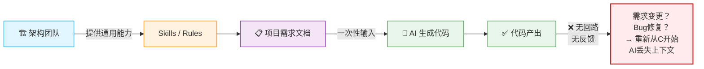
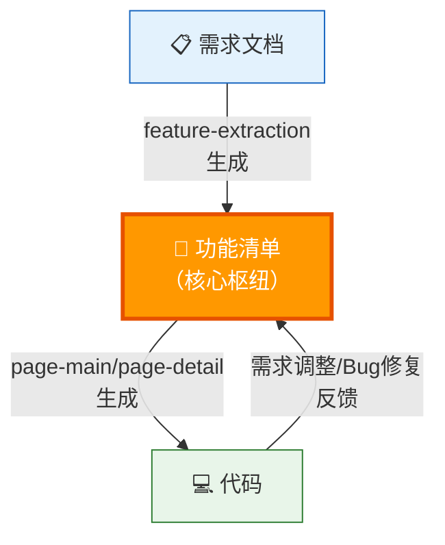
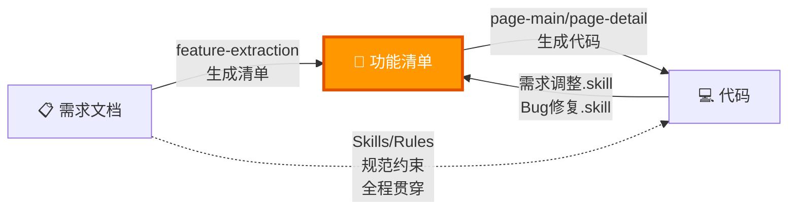
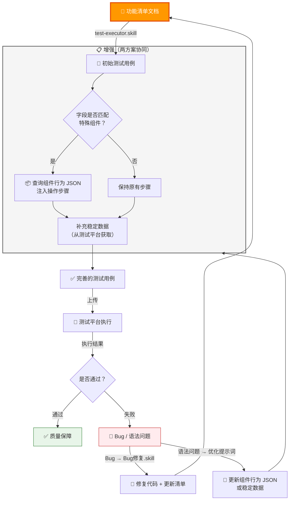

## 一、以前大家使用 AI 开发代码的方式
### 1.1 现状：断裂的线性流程

架构提供 **Skills** 和 **Rules** 供项目复用，项目通过架构提供的工具和需求文档生成代码。虽然代码生成的效率提高了，但其实**提高的主要是代码的深度和个人写代码的能力**，对团队或项目前端来说，整体效率提升并不高。

**核心问题：这是一个断裂的线性流程** —— 代码生成后没有回路，后续的需求变更、Bug 修复需要重新让 AI 从零理解业务，之前的上下文全部丢失。

### 1.2 两大根本问题
**问题一：缺乏项目专属工具**

架构提供的工具属于通用性工具，能够解决大部分通用场景，但项目与框架的工作流程和业务需求存在很多差异，只能靠人工去补充。更严重的是，每个人补全的方式不同，导致 AI 在不同人手中产出不一致，质量不可控。

**问题二：缺乏完整的工作流程**

实际开发中，大部分情况是项目给出初版需求文档，前端根据需求文档直接生成代码。代码虽然成功生成，但对后续的管理和维护没有一个明确的管理方式，容易导致：

+ **需求修改成本高**：AI 需要消耗更多 Token 去理解现有业务，结果质量和速度都受影响，且无法保证修改的正确性
+ **协同维护困难**：多次整改的业务页面，实际功能已偏离当初需求文档，只能通过现有代码 + 个人对业务熟悉程度进行后续维护，不容易发现潜在问题
+ **知识孤岛**：业务理解仅存在于个人脑中，人员变动后知识直接流失

---

## 二、建议优化方式：建立闭环工作流程
### 2.1 核心思路：以功能清单文档为枢纽构建闭环

**关键改变：从线性流程 → 闭环流程**

功能清单文档是整个闭环的枢纽，它连接了需求和代码两个核心环节，确保：

+ 任何变更都经过功能清单，AI 始终有最新的业务上下文
+ 代码和文档始终保持同步，不会出现"代码和文档不一致"的问题

### 2.2 为什么以功能清单为核心？
1. **以页面功能点为核心**，通过导航模块方式拆分页面，每个模块都有对应的详细清单
2. **为什么选择功能清单而非需求文档作为工作流核心？**
    - 需求文档涉及产品、后端、前端、测试等各个环节，同步维护难度较大
    - 一些前端特殊逻辑和数据处理放在需求文档中局限性太大
    - 功能清单文档是前端专属的，轻量、聚焦、易于维护
    - 功能清单结构化程度高，AI 可以更高效地理解和定位

### 2.3 两个闭环的协同逻辑
| 闭环 | 触发条件 | 核心动作 | 闭环关键 |
| --- | --- | --- | --- |
| **开发环** | 新需求 → 生成功能清单 | 功能清单 → 代码 → 验证 → 更新清单 | 代码与清单始终同步 |
| **维护环** | 需求变更 / Bug 报告 | 读取清单 → 定位代码 → 修改 → 更新清单 | AI 始终有最新上下文 |

**两个环的交汇点就是功能清单文档**，它是唯一的"业务真相源"（Single Source of Truth），确保所有环节的信息一致。

---

## 三、现有工具 & 项目需自行完善的技能
### 3.1 技能体系

### 3.2 架构已提供的工具
| 工具 | 作用 | 闭环角色 |
| --- | --- | --- |
| **Skills / Rules（架构代码规范）** | 帮助 AI 理解项目规范，按照规范开发和修改代码 | 全程贯穿，确保代码质量一致性 |
| **feature-extraction.skill（功能清单文档）** | ① 接收需求文档、示意图、代码，在指定位置生成前端功能清单文档；② 协助 AI 了解功能清单文档位置和结构规范，快速理解业务和定位代码位置 | 创建功能清单，启动所有闭环 |

### 3.3 项目需要自行完善的
| 技能 | 说明 | 闭环角色 |
| --- | --- | --- |
| **需求调整.skill** | 根据功能清单文档快速理解业务和代码，结合调整需求更新代码和文档 | 驱动维护闭环（需求变更场景） |
| **Bug 修复.skill** | 结合项目流程修复 Bug 并同步更新功能清单文档（例如：云效任务管理） | 驱动维护闭环（Bug 场景） |

**为什么项目必须自行完善这两个 skill？**

因为不同项目的业务流程、数据结构、接口规范差异很大，架构无法提供通用的需求调整和 Bug 修复方案。项目组需要根据自身特点封装专属 skill，让 AI 在理解业务后能按照项目约定的工作流执行变更，而不是每次都靠人工指导。

---

## 四、未来测试平台功能规划
### 4.1 目标：测试闭环
前端自己初步使用 AI 生成测试用例 → 上传到测试平台 → 测试平台自动化 24 小时测试 → 测试结果反馈到功能清单 → 形成质量闭环。

### 4.2 当前卡点
**卡点一：自定义语法合规**

测试平台为了保证测试动作能正确执行，采用了脚本和自然语言两种方式兜底，定义了一套自定义语法。但 `test-executor.skill` 生成的语法在部分情况下没有按照自定义语法执行，导致测试用例上传后部分步骤无法正确运行。

**卡点二：特殊组件的准确性**

一些组件的操作行为复杂，或者很难找到正确的测试数据，即使使用 AI 自己摸索也难以正确执行，生成的测试步骤实际执行时失败率高。

### 4.3 解决方案
| 方案 | 做法 | 价值 |
| --- | --- | --- |
| **稳定数据注入** | 在 AI 提示词中添加稳定数据（例：产品 AS50/AS01），每个分类维护 5-10 个，由测试平台统一管理，支持同一套用例在不同环境使用 | 解决"AI 找不到正确测试数据"的问题 |
| **组件行为映射** | 前端本地维护组件行为 JSON 配置，记录特殊组件的操作行为（如放大镜组件需点击→等待弹出层→选择），AI 生成测试时自动注入对应操作步骤 | 解决"复杂组件操作 AI 无法自行摸索"的问题 |

### 4.4 两个方案的协同闭环

测试用例执行失败时，会触发两条反馈回路：

+ **Bug 类问题**：通过 Bug修复.skill 修复代码，同步更新功能清单
+ **语法/数据问题**：优化组件行为 JSON 或稳定数据，下次生成时自动改进

这样稳定数据和组件行为映射也在持续优化，形成**数据质量闭环**。

---

## 五、总结：从线性到闭环
### 5.1 前后对比
| 维度 | 以前（线性） | 现在（闭环） |
| --- | --- | --- |
| **信息载体** | 需求文档（多方共用，难维护） | 功能清单（前端专属，轻量精确） |
| **AI 上下文** | 每次从零理解，消耗大量 Token | 读取功能清单，快速精准理解 |
| **变更处理** | 人工补充 + 代码推断，质量不可控 | 功能清单定位 → AI 修改 → 清单同步更新 |
| **协同效率** | 知识存在于个人脑中，人走知识丢 | 知识沉淀在功能清单中，团队共享 |
| **一致性** | 每个人做法不同，输出不一致 | 功能清单是唯一真相源，输出一致 |

### 5.2 核心思想
**以功能清单文档为枢纽**，构建"开发-维护"双环合一的闭环工作流。让 AI 不是一次性"写完就忘"，而是持续理解业务上下文，真正提高团队级的开发效率。

未来测试闭环成熟后，将与开发环、维护环形成三环合一的完整质量保障体系。

### 5.3 下一步行动
| 优先级 | 行动 | 负责方 | 闭环贡献 |
| --- | --- | --- | --- |
| **P0** | 使用 `feature-extraction.skill` 为现有页面生成功能清单文档 | 项目组 | 创建枢纽，启动闭环 |
| **P0** | 各项目组完善自己的 **需求调整.skill** 和 **Bug修复.skill** | 项目组 | 打通维护闭环 |
| **P1** | 配合测试平台推进 `test-executor.skill` 优化，解决语法合规问题 | 架构 + 测试平台 | 打通测试闭环 |
| **P1** | 前端项目建立组件行为映射 JSON | 项目组 | 提升测试用例准确性 |
| **P2** | 测试平台建立稳定数据池，支持多环境复用 | 测试平台 | 提升测试数据质量 |
| **P2** | 测试结果自动反馈到功能清单，形成完整质量闭环 | 架构 + 测试平台 | 闭环自动化 |

